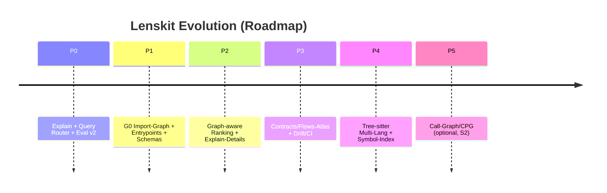

# Retrieval Project Roadmap

Tracking the evolution of lenskit retrieval from basic artifacts to an intelligent "Retrieval OS".

## Vision
**Mach Lenskit zur Repository-Kognition-Engine mit minimalem, hartem Maschinenvertrag:**
Lenskit produziert bereits kanonische, deterministische Artefakte (Markdown, JSON, Retrieval-Index) mit maschinenlesbarer Provenienz. Um epistemische Blindheit (z. B. Bevorzugung sprachlicher Oberflächen bei BM25) zu vermeiden, wird Lenskit um ein **mehrschichtiges, evidenzmarkiertes Architekturmodell** erweitert.

1. Truth Layer (Dump + Chunk + Reading Policy)
2. Index Layer (SQLite + Eval + Graph-Index)
3. Interface Layer (Query/Eval JSON mit Explain + Staleness + Provenance)

Dieses Architekturmodell wird reproduzierbar aus bestehenden Artefakten abgeleitet, per JSON-Schema validiert und im Retrieval direkt verwertet. Die Sichten sind strikt nach Evidenz (statt Scheinpräzision) gegliedert:
- **S0 (belegt):** Struktur, Entrypoints, deklarative Abhängigkeiten, Artefakt-/Contract-Flüsse.
- **S1 (hoch plausibel):** Import-Graph, CLI-Kommandokette, statische Wiring-Heuristiken.
- **S2 (spekulativ):** Laufzeitpfade/Hotspots (nur mit Logs/Tracing).

**Alternative Sinnachse: „Maschinen-Operabilität“ statt „Suchqualität“**
Wenn das Ziel nicht „Code finden“, sondern „System steuerbar machen“ ist, wird der Contracts/Flows-Atlas zum primären Graph.

Maschinen-Operabilität =
- deterministische Identifikatoren
- stabile Pfade/roles
- range-resolver
- maschinenlesbare Stale/Validity
- standardisierte Explainability
- Gate-Metriken

Suchqualität kommt dann fast automatisch.

## Upgrade Roadmap: Graph-Index & Explainability (Phasen P0-P5)

Die erwarteten Recall-Gewinne sind plausible Schätzungen.

| Phase | Kernziel | Haupt-Risiko |
|---|---|---|
| P0 | Retrieval „ehrlich & debugbar“ (Explain, Query Router, Eval v2) | Overmatching / falsche Sicherheit |
| P1 | **G0 Graph-Index**: Python Import-Graph + Entrypoints + Evidenzlabel (S0/S1) | Scheinpräzision, Tests verzerren |
| P2 | Graph-aware Scoring: BM25 + Nähe + Entrypoint-Dist + Test-Penalty | Tuning/Tradeoffs |
| P3 | Contracts/Flows-Atlas (Alternative Achse) + CI/Drift Regeln | Governance-Overhead |
| P4 | Multi-Lang Parsing (Tree-sitter) + Symbol-Index v2 | Parser-Wartung |
| P5 | Call-Graph/CPG v2 (S2) | falsch-positive Pfade |

Weitere Details zu den Upgrade-Phasen finden sich in [upgrade-roadmap.md](upgrade-roadmap.md).

## Blueprint Status (Lenskit vNext)

### Phase A — Maschinenvertrag schließen (Contracts + Artefaktgraph)
**Ziel:** Ein Agent kann ohne Ratespiel alle Artefakte finden und korrekt interpretieren.

- [x] **A1) „Bundle Manifest“ als Root of Navigation**
    - Neuer Contract: `bundle-manifest.v1`
    - Enthält: `run_id`, `created_at`, `generator` (inkl. `config_sha256`, `version`)
    - `artifacts[]`: required: `role`, `path`, `content_type`, `bytes`, `sha256`, und conditional `contract` objekt (`id`, `version`)
    - `links`: `canonical_dump_index_sha256`, `derived_from` (Graphkanten)
    - `capabilities`: z.B. `fts5_bm25=true/false`, `redaction=true/false`
    - Prinzip: Ein Einstiegspunkt, der alles beschreibt. Keine Directory-Heuristiken.
    - **Stop-Kriterium:** Agent findet aus einer Datei alle relevanten Artefakte. Deterministische Interpretation erfolgt über das role-Enum sowie referenzierte Contracts für strukturierte Daten.

- [x] **A2) Eindeutige Rollenliste (Taxonomie)**
    - Definiere eine feste Rollenliste (Enum) für: `canonical_md`, `index_sidecar_json`, `chunk_index_jsonl`, `dump_index_json`, `sqlite_index`, `retrieval_eval_json`, `derived_manifest_json`, `delta_json` (falls vorhanden)
    - Verhindert Drift („role“-Strings sind sonst Spaghetti).
    - **Stop-Kriterium:** Role ist nie frei-textig, sondern enum-validiert.

### Phase B — Range-Resolver als Maschinendienst (Zitierbarkeit)
**Ziel:** Maschinen holen Content exakt per Range, ohne Markdown parsen zu „müssen“.

- [x] **B1) Standardisiere „Range Identity“**
    - Contract: `range-ref.v1`
    - Felder: `artifact_role` (oder `artifact_path`), `repo_id`, `path`, `start_byte`, `end_byte`, `start_line`, `end_line`, `content_sha256` (Hash des exakt referenzierten Ausschnitts, empfohlen: Hash des Chunk-Inhalts).

- [x] **B2) CLI/Lib: `lenskit range get`**
    - `lenskit range get --manifest bundle.manifest.json --ref <range-ref.json>`
    - Ausgabe: exact bytes + optional line-context, optional JSON: `{text, sha256, bytes, lines, provenance}`
    - **Stop-Kriterium:** Ein Agent kann jeden Treffer mit `range get` reproduzierbar ausgeben und zitieren.

### Phase C — Query/Eval Interface perfektionieren (Explainability + Gates)
**Ziel:** Treffer sind nicht nur da, sondern erklärbar und testbar.

- [x] **C1) `query_result.v1` (maschinenlesbares Explain)**
    - Erweitere Query-JSON um standardisierte Explainability: `query`, `filters`, `k`, `engine`, `applied_filters`
    - `results[]` mit: `range_ref` (nicht nur range-string), `score`, `why`: `matched_terms` (aus FTS), `filter_pass` (welche Filter aktiv waren), `rank_features` (z.B. bm25, tie-breaker), Optional: `diagnostics` (fts_available, stale_index, etc.)
    - **Stop-Kriterium:** „Warum ist das Ergebnis da?“ ist maschinenlesbar beantwortbar.

- [x] **C2) Gold Queries als Gate (nicht nur Doku)**
    - `docs/retrieval/queries.md` bleibt human-friendly.
    - Zusätzlich: `docs/retrieval/queries.v1.json` (Query, expected_patterns, filters, accept_criteria).
    - Eval schreibt: `recall@k`, `per_query`: hit/miss + hit_path + why + stale_flag.
    - **Stop-Kriterium:** CI kann ein klares Pass/Fail aussprechen (z.B. recall@10 >= 0.8).

### Phase D — Index Lifecycle: Validity & Staleness als First-Class
**Ziel:** Maschinen sollen nicht „aus Versehen“ stale Indizes nutzen.

- [x] **D1) Index Meta Table + Manifest Validity**
    - In SQLite `index_meta`: `canonical_dump_index_sha256`, `config_sha256`, `created_at`, `lenskit_version`.
    - In derived manifest: `canonical_dump_index_sha256`, zusätzlich `config_sha256`.

- [x] **D2) Stale-Policy (konfigurierbar)**
    - `--stale-policy warn|fail|ignore`
    - Default für Agents: `fail` (damit sie nicht still falsch arbeiten).
    - **Stop-Kriterium:** Stale Index kann nicht unbemerkt genutzt werden.

### Phase E — PR-Verstehen als eigener Entry (ohne Symbolik, v1)
**Ziel:** PR-Usecase bedienbar machen, ohne gleich Symbolgraph zu bauen.

- [x] **E1) `pr-schau-delta.v1` minimal operational**
    - `changed_files[]` + `hunks` optional.
    - Zusätzlich: `affected_chunk_ids[]` oder `affected_range_refs[]` (Mapping durch Chunk/Range-Overlap ist optional in v1 und kann anfangs leer sein).

- [x] **E2) CLI: `lenskit pr-explain`**
    - Gibt aus: changed files, top related chunks per file (context), suspicious patterns (secrets, auth, migrations) nur lexikalisch als heuristische Flags (klar markiert).
    - **Stop-Kriterium:** Agent kann PR-Kontext automatisch laden.

### Phase F — (bewusst später) Semantik als Re-Ranker
**Ziel:** Nur nachdem A–E stabil sind.

- [x] **F1a) Semantik Re-Ranker (Plumbing)**
    - `candidate` (Top-50) → `rerank` (Top-10) Plumbing (semantic request marker, candidate overfetch, diagnostics, fail/ignore enforcement).
    - `embedding-policy.v1` Validation und CLI-Wiring.
    - **Stop-Kriterium:** `fallback_behavior` ist enforced (ignore/fail). Pipeline ist fehlerfrei vorbereitet, aber noch ohne echtes ML-Modell.

- [ ] **F1b) Semantik Re-Ranker (Model Integration)**
    - Eval: improvement delta vs non-semantic.
    - **Stop-Kriterium:** Messbare Verbesserung (improvement delta) ohne neue Failure-Klasse.

## Empfohlene Reihenfolge (nächste Aktionen)
- [x] A1/A2 Bundle Manifest + Rollen-Enum
- [x] B1/B2 Range-Resolver
- [x] C1/C2 Explain + Gold-Query JSON + CI Gate
- [x] D1/D2 Stale fail-policy
- [x] E1/E2 PR explain (ohne Symbolik)
- [ ] F später

---

## Historischer Verlauf (abgeschlossene Phasen)

### Phase 0: Invarianten & Zielmetriken
- [x] **Goal:** Reproducibility & Forensics
- [x] **Artifacts:**
    - `docs/retrieval/queries.md` (Gold Queries)
    - `dump_index.json` (Canonical Entry Point)
    - Deterministic chunk IDs (in `chunk_index.jsonl`)

### Phase 1: Artefakt-Schicht (Wahrheit + Navigation)
- [x] **Goal:** Agent can navigate without heuristics.
- [x] **Implemented:**
    - `chunk_index.jsonl` with deterministic fields.
    - `dump_index.json` linking all artifacts.
    - Reading Policy sentinels in MD and JSON.
    - JSON Sidecar with `features` list.

### Phase 2: Lexikalische Retrieval-Schicht (FTS)
- [x] **Goal:** Explainable, fast search.
- [x] **Implemented:**
    - **CLI:** `lenskit index` & `lenskit query`.
    - **Engine:** SQLite FTS5 (`chunks_fts` virtual table).
    - **Scoring:** `bm25` (standard, explainable).
    - **Docs:** `docs/retrieval/recipes.md`.
    - **Safety:** Stale index detection via hash linkage.
- [x] **Implemented (v1):** eval runner via `lenskit eval` with JSON output.
    - **Schema:** `merger/lenskit/contracts/retrieval-eval.v1.schema.json`
    - **Tests:** `test_retrieval_eval.py`

## Current Milestones (Legacy)
- **Status:** Phase 2 Complete (FTS + Query + Eval Schema).
- **Evaluation:** First benchmark run completed against `merger` self-scan. Recall@10 is 20.0% (3/15 hits) with relevant hits for `index`, `merge`, and `cli`. Low recall is expected as the Gold Queries set includes generic targets (auth, db, docker) not present in the current repository scope.
