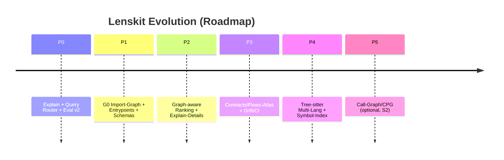

# Upgrade Roadmap: Lenskit als Repository-Kognition-Engine

## Vision & Synthese
Lenskit produziert kanonische, deterministische Artefakte (Markdown, JSON, Retrieval-Index) mit maschinenlesbarer Provenienz. Um epistemische Blindheit (z. B. Bevorzugung sprachlicher Oberflächen bei BM25) zu vermeiden, wird Lenskit um ein **mehrschichtiges, evidenzmarkiertes Architekturmodell** erweitert.

Dieses Modell wird reproduzierbar aus bestehenden Artefakten abgeleitet, per JSON-Schema validiert und im Retrieval direkt verwertet. Die Sichten sind strikt nach Evidenz (statt Scheinpräzision) gegliedert:
- **S0 (belegt):** Struktur, Entrypoints, deklarative Abhängigkeiten, Artefakt-/Contract-Flüsse.
- **S1 (hoch plausibel):** Import-Graph, CLI-Kommandokette, statische Wiring-Heuristiken.
- **S2 (spekulativ):** Laufzeitpfade/Hotspots (nur mit Logs/Tracing).

**Alternative Sinnachse:** Wenn das Ziel nicht „Code finden“, sondern „System steuerbar machen“ ist, wird der Contracts/Flows-Atlas zum primären Graph.

**Priorität:** Implementierung des G0-Graphen (Python-Import-Graph + Entrypoints + Evidenzlabel S0/S1 + Explain) vor Call-Graphen.

## Roadmap in Phasen

Die erwarteten Recall-Gewinne sind plausible Schätzungen.

| Phase | Kernziel | Haupt-Risiko |
|---|---|---|
| P0 | Retrieval „ehrlich & debugbar“ (Explain, Query Router, Eval v2) | Overmatching / falsche Sicherheit |
| P1 | **G0 Graph-Index**: Python Import-Graph + Entrypoints + Evidenzlabel (S0/S1) | Scheinpräzision, Tests verzerren |
| P2 | Graph-aware Scoring: BM25 + Nähe + Entrypoint-Dist + Test-Penalty | Tuning/Tradeoffs |
| P3 | Contracts/Flows-Atlas (Alternative Achse) + CI/Drift Regeln | Governance-Overhead |
| P4 | Multi-Lang Parsing (Tree-sitter) + Symbol-Index v2 | Parser-Wartung |
| P5 | Call-Graph/CPG v2 (S2) | falsch-positive Pfade |



## Build- und Query-Pipelines

Lenskit nutzt Hash-basierte Provenienz. Die erweiterte Pipeline führt Graph-Index und Entrypoints ein.

```mermaid
flowchart LR
  Repo[Repo scan / merge] --> Dump[dump_index.json]
  Repo --> MD[canonical_md (.md parts)]
  Repo --> Chunks[chunk_index.jsonl]

  Dump -->|canonical_dump_index_sha256| Derived[derived_index.json]
  Chunks --> SQLite[(chunk_index.index.sqlite)]
  Derived --> SQLite

  Chunks --> Arch[architecture.graph.json]
  Chunks --> EP[entrypoints.json]
  Arch --> GIdx[graph_index.json]
  EP --> GIdx

  SQLite --> Query[lenskit query]
  GIdx --> Query
  Query --> Eval[retrieval_eval.json]
```

## Artefakte und Contracts

Evidenzlevel (S0/S1/S2) ist ein Pflichtfeld. Import-Graphen dürfen nicht als Laufzeitgraphen fehlgedeutet werden.

### architecture.graph.v1 Schema
```json
{
  "$schema": "http://json-schema.org/draft-07/schema#",
  "$id": "https://heimgewebe.local/schema/architecture.graph.v1.schema.json",
  "title": "Architecture Graph (architecture.graph v1)",
  "type": "object",
  "additionalProperties": false,
  "required": ["kind", "version", "run_id", "canonical_dump_index_sha256", "nodes", "edges", "coverage"],
  "properties": {
    "kind": { "const": "lenskit.architecture.graph" },
    "version": { "const": "1.0" },
    "run_id": { "type": "string" },
    "canonical_dump_index_sha256": { "type": "string", "pattern": "^[a-f0-9]{64}$" },
    "generated_at": { "type": "string" },
    "granularity": { "type": "string", "enum": ["file", "package", "module"] },
    "nodes": {
      "type": "array",
      "items": {
        "type": "object",
        "additionalProperties": false,
        "required": ["node_id", "kind", "path", "repo", "is_test"],
        "properties": {
          "node_id": { "type": "string" },
          "kind": { "type": "string", "enum": ["file", "package", "module", "external"] },
          "path": { "type": "string" },
          "repo": { "type": "string" },
          "language": { "type": "string" },
          "layer": { "type": "string" },
          "is_test": { "type": "boolean" },
          "size_bytes": { "type": "integer", "minimum": 0 }
        }
      }
    },
    "edges": {
      "type": "array",
      "items": {
        "type": "object",
        "additionalProperties": false,
        "required": ["src", "dst", "edge_type", "evidence", "evidence_level"],
        "properties": {
          "src": { "type": "string" },
          "dst": { "type": "string" },
          "edge_type": { "type": "string", "enum": ["import", "require", "config-link", "string-ref", "call-heuristic"] },
          "evidence_level": { "type": "string", "enum": ["S0", "S1", "S2"] },
          "evidence": {
            "type": "object",
            "additionalProperties": false,
            "required": ["source_path"],
            "properties": {
              "source_path": { "type": "string" },
              "start_line": { "type": "integer", "minimum": 1 },
              "end_line": { "type": "integer", "minimum": 1 },
              "extract": { "type": "string", "maxLength": 240 }
            }
          }
        }
      }
    },
    "coverage": {
      "type": "object",
      "additionalProperties": false,
      "required": ["files_seen", "files_parsed", "edge_counts_by_type", "unknown_layer_share"],
      "properties": {
        "files_seen": { "type": "integer", "minimum": 0 },
        "files_parsed": { "type": "integer", "minimum": 0 },
        "edge_counts_by_type": { "type": "object" },
        "unknown_layer_share": { "type": "number", "minimum": 0, "maximum": 1 }
      }
    }
  }
}
```

### entrypoints.v1 Schema
```json
{
  "$schema": "http://json-schema.org/draft-07/schema#",
  "$id": "https://heimgewebe.local/schema/entrypoints.v1.schema.json",
  "title": "Entrypoints (entrypoints v1)",
  "type": "object",
  "additionalProperties": false,
  "required": ["kind", "version", "run_id", "canonical_dump_index_sha256", "entrypoints"],
  "properties": {
    "kind": { "const": "lenskit.entrypoints" },
    "version": { "const": "1.0" },
    "run_id": { "type": "string" },
    "canonical_dump_index_sha256": { "type": "string", "pattern": "^[a-f0-9]{64}$" },
    "entrypoints": {
      "type": "array",
      "items": {
        "type": "object",
        "additionalProperties": false,
        "required": ["id", "type", "path", "evidence_level"],
        "properties": {
          "id": { "type": "string" },
          "type": { "type": "string", "enum": ["cli", "module_main", "web", "worker", "test"] },
          "path": { "type": "string" },
          "symbol": { "type": "string" },
          "evidence_level": { "type": "string", "enum": ["S0", "S1", "S2"] },
          "evidence": { "type": "object" }
        }
      }
    }
  }
}
```

### contracts.graph.v1 Schema (Alternative Achse)
```json
{
  "$schema": "http://json-schema.org/draft-07/schema#",
  "$id": "https://heimgewebe.local/schema/contracts.graph.v1.schema.json",
  "title": "Contracts/Flows Graph (contracts.graph v1)",
  "type": "object",
  "additionalProperties": false,
  "required": ["kind", "version", "nodes", "edges"],
  "properties": {
    "kind": { "const": "lenskit.contracts.graph" },
    "version": { "const": "1.0" },
    "nodes": {
      "type": "array",
      "items": {
        "type": "object",
        "required": ["id", "kind"],
        "properties": {
          "id": { "type": "string" },
          "kind": { "type": "string", "enum": ["artifact", "contract", "command", "ci_check"] },
          "schema_id": { "type": "string" }
        }
      }
    },
    "edges": {
      "type": "array",
      "items": {
        "type": "object",
        "required": ["src", "dst", "edge_type", "evidence_level"],
        "properties": {
          "src": { "type": "string" },
          "dst": { "type": "string" },
          "edge_type": { "type": "string", "enum": ["produces", "consumes", "validates", "guards"] },
          "evidence_level": { "type": "string", "enum": ["S0", "S1", "S2"] }
        }
      }
    }
  }
}
```

### Chunk-Metadaten & Range_ref Integration
- **Metadaten-Erweiterung:** `chunk_index.jsonl` erhält optional die Felder `symbol_name`, `node_id`, `entrypoint_distance`, `is_test_penalty`.
- **Proof-Carrying Retrieval (`range_ref`):** Für eine deterministische Extraktion muss der Byte-Range-Bezug zwischen Retrieval-Treffer und Artefaktpfad (`artifact_role = "canonical_md"`) hergestellt werden.
```json
{
  "artifact_role": "canonical_md",
  "file_path": "lenskit-max-..._merge.md",
  "start_byte": 214998,
  "end_byte": 217441,
  "content_sha256": "…",
  "start_line": 1203,
  "end_line": 1321
}
```

## Retrieval-Integration und Explain

### Ranking-Formel
Kombination aus BM25 (FTS5) und Graph-Nähe:
```text
score = w_bm25 * bm25_norm
      + w_graph * graph_proximity
      + w_entry * entrypoint_boost
score = score * test_penalty
```

### Explain Output (Beispiel)
Transparenz über Query-Routing, Gewichte und Treffer-Gründe:
```json
{
  "query": "where does indexing start",
  "router": {
    "intent": "entrypoint",
    "fts_query": "content:(index OR indexing OR build_index) AND path_tokens:(cli OR cmd OR main)",
    "synonyms_used": ["indexing", "build_index"]
  },
  "ranker": {
    "w_bm25": 0.65,
    "w_graph": 0.20,
    "w_entry": 0.15,
    "test_penalty_default": 0.75
  },
  "top_results": [
    {
      "path": "merger/lenskit/cli/main.py",
      "final_score": 0.12,
      "why": ["entrypoint_boost", "near_cli", "not_test"]
    }
  ]
}
```

## Drift Detection und CI-Regeln
- Metriken für den Graph-Index (Zyklen-Count, Anteil unknown layer, Entrypoint-Reachability) dienen als Guardrails.
- Contract-First: Jede neue ArtifactRole erfordert Schema, Beispiel und Test.
- `canonical_dump_index_sha256` Verknüpfung in generierten Graphen (`architecture.graph.json`) muss matchen, ansonsten greift die Stale-Policy.

## Nächste Pull Requests (Priorisiert)

Strategie: Additiv statt brechend (neue Artefakte als roles, Feature Flags).

### PR 1: Explain und Query Router MVP (P0)
- `retrieval`: `query_router` (Synonyme, Intent-Tags).
- `cli(query)`: `--explain` Flag, das Router, SQL und Scores ausgibt.
- FTS5 Query-Rewrite mit OR-Expansion und Spaltenfilter (`content:`, `path_tokens:`).

### PR 2: Eval v2 (P0)
- `eval`: Schema-Erweiterung für per-category recall@5/10.
- `eval_core`: Metrikenberechnung pro Kategorie.

### PR 3: G0 Import-Graph + Entrypoints + Schemas (P1)
- `contracts`: `architecture.graph.v1` + `entrypoints.v1` Schemas.
- `architecture`: Aufbau des Import-Graphen aus `chunk_index.jsonl` (AST Import/ImportFrom).
- `cli`: Neues `lenskit architecture` Kommando.

### PR 4: graph_index + graph-aware rerank (P2)
- `graph_index`: Kompilierung von Adjazenz und Entrypoint-Distanzen.
- `retrieval`: Feature Join (Score Blend) + Test-Penalty.
- `cli(query)`: Explain um Graph-Terme erweitern.

### PR 5: range_ref re-aktivieren (P1/P2)
- `chunk_index`: `content_range_ref` (bundle-consistent) beim Erzeugen des Merge-MD aus Offsets berechnen.
- `query_result`: Optionale Ausgabe von `range_ref` pro Treffer.
